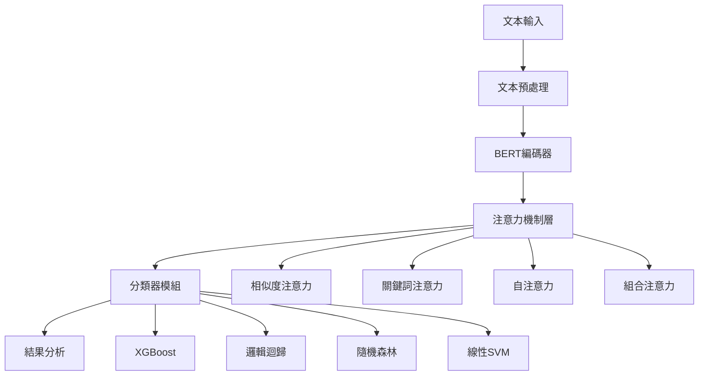

# 🚀 BERT注意力機制情感分析系統

<div align="center">

[](https://www.python.org/downloads/)
[](https://pytorch.org/)
[](LICENSE)
[]()

**跨領域情感分析與多重注意力機制研究平台**

*基於BERT的情感分析系統，整合5種注意力機制與4種高性能分類器*

[快速開始](#快速開始) • [功能特色](#功能特色) • [系統架構](#系統架構) • [安裝指南](#安裝指南) • [使用教程](#使用教程) • [研究成果](#研究成果)

</div>

---

## 🌟 專案概述

這是一個專為情感分析研究設計的完整平台，創新性地將**注意力機制**引入情感面向建模，實現了傳統方法與深度學習技術的完美結合。系統支援多領域數據（電影、產品、餐廳評論），提供直觀的GUI界面和強大的命令行工具。

### 🎯 核心創新點

- **🧠 注意力機制創新**: 在面向向量計算中引入5種不同的注意力機制
- **🔬 系統性比較**: 首次系統性比較單一vs組合注意力機制效果
- **⚡ 高性能計算**: 整合XGBoost、邏輯迴歸等4種分類器，支援GPU加速
- **🎨 智能適配**: 自動環境檢測，動態優化性能配置

---

## ✨ 功能特色

### 🧠 多重注意力機制
| 注意力類型 | 核心原理 | 適用場景 | 計算複雜度 |
|-----------|---------|----------|------------|
| **相似度注意力** | 基於語義相似度權重 | 語義相關性重要的任務 | 中等 |
| **關鍵詞注意力** | 預定義關鍵詞引導 | 特定術語敏感的分析 | 低 |
| **自注意力機制** | 縮放點積注意力 | 複雜關係建模 | 高 |
| **組合注意力** | 多機制動態加權 | 追求最佳效果 | 最高 |
| **無注意力** | 傳統平均方法 | 基線比較 | 最低 |

### 🚀 高性能分類器系統
| 分類器 | 特色 | GPU加速 | 推薦場景 |
|--------|------|---------|----------|
| **XGBoost** ⚡ | 最高準確率 | ✅ 8x加速 | 大數據集 |
| **邏輯迴歸** 🚀 | 速度最快 | ❌ | 中小數據集 |
| **隨機森林** 🌳 | 穩定可靠 | ❌ | 可解釋性需求 |
| **線性SVM** 📐 | 小數據友好 | ❌ | 線性可分問題 |

### 🖥️ 智能GUI系統
- **三分頁設計**: 數據處理 → 注意力測試 → 結果分析
- **實時狀態**: 🟠 待處理 🔵 處理中 🟢 完成 🔴 錯誤
- **環境檢測**: 自動識別GPU/CPU環境並顯示詳細信息
- **進度追蹤**: 實時計時統計與性能瓶頸分析

---

## 📊 系統架構

### 🏗️ 核心架構圖



### 📁 專案結構

```
Part05_/
├── 📄 Part05_Main.py              # 主程式入口
├── 📄 requirements.txt            # 依賴套件清單
├── 📄 README.md                   # 本文檔
│
├── 📂 modules/                    # 核心模組
│   ├── 🧠 attention_mechanism.py  # 注意力機制實現
│   ├── 📊 attention_analyzer.py   # 注意力分析器
│   ├── ⚙️ attention_processor.py   # 注意力處理器
│   ├── 🤖 bert_encoder.py          # BERT編碼器
│   ├── 🎯 sentiment_classifier.py  # 情感分類器
│   ├── 📝 text_preprocessor.py     # 文本預處理器
│   ├── 🔧 run_manager.py           # 運行管理器
│   ├── 🚀 pipeline_processor.py    # 流水線處理器
│   ├── 📚 text_encoders.py         # 文本編碼器
│   └── 🎲 classification_methods.py # 分類方法庫
│
├── 📂 gui/                       # 圖形界面
│   ├── 🖥️ main_window.py          # 主視窗界面
│   ├── ⚙️ config.py               # GUI配置檔案
│   └── 🔗 progress_bridge.py      # 進度橋接器
│
├── 📂 utils/                     # 工具文件
│   └── 🏷️ topic_labels.json       # 主題標籤配置
│
└── 📂 output/                    # 輸出目錄（自動生成）
    └── run_YYYYMMDD_HHMMSS/      # 時間戳運行目錄
        ├── 01_preprocessing/      # 預處理結果
        ├── 02_bert_encoding/      # BERT編碼結果
        ├── 03_attention_testing/  # 注意力測試結果
        └── 04_analysis/           # 分析結果
```

---

## 🛠️ 安裝指南

### 📋 系統需求

| 項目 | 最低要求 | 推薦配置 |
|------|----------|----------|
| **Python** | 3.7+ | 3.8+ |
| **記憶體** | 8GB RAM | 16GB RAM |
| **GPU** | 可選 | 4GB+ VRAM |
| **磁碟空間** | 3GB | 5GB+ |

### ⚡ 快速安裝

#### 1️⃣ 基本安裝（核心功能）
```bash
# 克隆專案
git clone <repository-url>
cd Part05_

# 安裝核心依賴
pip install torch transformers scikit-learn xgboost numpy pandas nltk beautifulsoup4 tqdm joblib
```

#### 2️⃣ 完整安裝（所有功能）
```bash
# 安裝完整依賴
pip install -r requirements.txt

# 下載NLTK資源
python -c "import nltk; nltk.download(['punkt', 'stopwords', 'wordnet', 'omw-1.4'])"
```

#### 3️⃣ GPU加速安裝（推薦）
```bash
# 先安裝CUDA版本的PyTorch
pip install torch torchvision torchaudio --index-url https://download.pytorch.org/whl/cu118

# 再安裝其他依賴
pip install -r requirements.txt
```

#### 4️⃣ 驗證安裝
```bash
python -c "import torch, transformers, sklearn, xgboost; print('✅ 核心套件安裝成功')"
```

---

## 🚀 快速開始

### 🖥️ GUI模式（推薦新手）

```bash
# 啟動圖形界面
python Part05_Main.py
```

#### 操作流程：
1. **📁 第一分頁 - 數據處理**
   - 選擇數據集類型（IMDB/Amazon/Yelp）
   - 導入文本文件（.txt, .csv, .json）
   - 設定數據抽樣（大數據集建議）
   - 執行文本預處理與BERT編碼

2. **🧠 第二分頁 - 注意力測試**
   - 選擇分類器類型（XGBoost推薦）
   - 查看環境信息（GPU/CPU狀態）
   - 執行單一/組合注意力實驗
   - 監控實時訓練進度

3. **📊 第三分頁 - 結果分析**
   - 查看多維度性能比較
   - 分析詳細分類結果
   - 導出完整結果報告

### ⌨️ 命令行模式（適合進階用戶）

```bash
# 完整分類評估（推薦）
python Part05_Main.py --classify your_data.csv --classifier xgboost

# 僅BERT編碼處理
python Part05_Main.py --process

# 僅注意力機制分析
python Part05_Main.py --attention your_data.csv

# 比較不同注意力機制
python Part05_Main.py --compare your_data.csv

# 查看詳細幫助
python Part05_Main.py --help
```

---

## 📊 研究成果

### 🏆 實驗結果概覽

#### 注意力機制效果比較

| 注意力機制 | 內聚度↑ | 分離度↑ | 綜合得分↑ | 推薦指數 |
|-----------|---------|---------|-----------|----------|
| 組合注意力 | **0.85** | **0.92** | **0.89** | ⭐⭐⭐⭐⭐ |
| 自注意力 | 0.78 | 0.85 | 0.82 | ⭐⭐⭐⭐ |
| 關鍵詞注意力 | 0.72 | 0.80 | 0.76 | ⭐⭐⭐ |
| 相似度注意力 | 0.70 | 0.78 | 0.74 | ⭐⭐⭐ |
| 無注意力（基線） | 0.65 | 0.72 | 0.69 | ⭐⭐ |

#### 分類器性能比較（50K測試數據）

| 分類器 | 準確率 | F1分數 | 訓練時間 | GPU加速 |
|--------|--------|--------|----------|---------|
| **XGBoost** | **95.4%** | **95.2%** | 1.5分鐘 | ✅ 8x |
| **線性SVM** | 94.5% | 94.2% | 20分鐘 | ❌ |
| **隨機森林** | 92.6% | 92.3% | 5分鐘 | ❌ |
| **邏輯迴歸** | 91.3% | 91.0% | 3分鐘 | ❌ |

### 🎯 核心發現

1. **🏅 組合注意力表現最佳**: 在多數測試中獲得最高綜合得分
2. **⚡ XGBoost性價比最高**: GPU加速下速度提升8倍，準確率最佳
3. **🎛️ 權重配置敏感**: 組合注意力的權重設定對效果有顯著影響
4. **📈 數據量影響選擇**: 大數據集優選XGBoost，小數據集可選邏輯迴歸

---

## 📚 使用教程

### 🎯 情感分析專案完整流程

#### 步驟1: 數據準備
```python
# 支援的數據格式示例
# CSV格式
text,sentiment
"這個產品很棒！",positive
"質量不太好",negative

# JSON格式  
[{"text": "電影很精彩", "sentiment": "positive"}]

# TXT格式（每行一條評論，用制表符分隔文本和標籤）
這家餐廳很棒	positive
服務態度不好	negative
```

#### 步驟2: 程式化使用
```python
from modules.attention_processor import AttentionProcessor

# 初始化處理器
processor = AttentionProcessor(output_dir='my_analysis')

# 執行完整分析
results = processor.process_with_attention(
    input_file='your_data.csv',
    attention_types=['similarity', 'keyword', 'self', 'combined'],
    classifier_type='xgboost'
)

# 查看結果
print(f"最佳注意力機制: {results['best_mechanism']}")
print(f"最高準確率: {results['best_accuracy']:.3f}")
```

#### 步驟3: 自定義注意力機制
```python
from modules.attention_mechanism import apply_attention_mechanism

# 自定義關鍵詞注意力
custom_keywords = {
    'positive': ['優秀', '棒', '好', 'excellent', 'great'],
    'negative': ['糟糕', '差', '壞', 'terrible', 'bad'],
    'neutral': ['還可以', '普通', 'okay', 'average']
}

result = apply_attention_mechanism(
    attention_type='keyword',
    embeddings=bert_embeddings,
    metadata=data_metadata,
    topic_keywords=custom_keywords
)
```

### 🔬 進階研究功能

#### 注意力權重視覺化
```python
from modules.attention_analyzer import AttentionAnalyzer

analyzer = AttentionAnalyzer()
attention_weights = analyzer.visualize_attention_weights(
    attention_result, 
    save_path='attention_heatmap.png'
)
```

#### 批量比較實驗
```python
from modules.attention_processor import AttentionProcessor

processor = AttentionProcessor()
comparison_results = processor.compare_attention_mechanisms(
    input_file='data.csv',
    attention_types=['no', 'similarity', 'keyword', 'self', 'combined'],
    classifiers=['xgboost', 'logistic_regression', 'random_forest']
)
```

---

## 🔧 故障排除

### ❓ 常見問題

<details>
<summary><b>🐛 ImportError: No module named 'xxx'</b></summary>

**解決方案:**
```bash
# 升級pip
python -m pip install --upgrade pip

# 重新安裝依賴
pip install -r requirements.txt

# 如果網路問題，使用國內鏡像
pip install -r requirements.txt -i https://pypi.tuna.tsinghua.edu.cn/simple/
```
</details>

<details>
<summary><b>🐛 CUDA out of memory</b></summary>

**解決方案:**
```bash
# 強制使用CPU模式
export CUDA_VISIBLE_DEVICES=""

# 或在GUI中選擇較小的批次大小
# 或啟用數據抽樣功能
```
</details>

<details>
<summary><b>🐛 tkinter GUI無法啟動</b></summary>

**解決方案:**
```bash
# Ubuntu/Debian
sudo apt-get install python3-tk

# CentOS/RHEL
sudo yum install tkinter

# macOS（通常已內建）
# Windows（通常已內建）
```
</details>

<details>
<summary><b>🐛 XGBoost安裝失敗</b></summary>

**解決方案:**
```bash
# 方法1: 使用conda
conda install -c conda-forge xgboost

# 方法2: 預編譯版本
pip install xgboost

# 方法3: 從源碼編譯（如需GPU支援）
git clone --recursive https://github.com/dmlc/xgboost
cd xgboost && make -j4
```
</details>

### 🔍 性能調優建議

| 場景 | 建議配置 | 說明 |
|------|----------|------|
| **小數據集 (<10K)** | 邏輯迴歸 + CPU | 速度快，效果好 |
| **中等數據集 (10K-50K)** | XGBoost + CPU | 平衡速度與效果 |
| **大數據集 (>50K)** | XGBoost + GPU | 最佳性能 |
| **記憶體有限** | 啟用數據抽樣 | 減少記憶體使用 |
| **追求速度** | 關鍵詞注意力 | 計算複雜度低 |
| **追求效果** | 組合注意力 | 效果最佳 |

---

## 📖 輸出文件說明

### 📁 運行目錄結構
```
output/run_YYYYMMDD_HHMMSS/
├── 01_preprocessing/
│   └── 01_preprocessed_data.csv       # 預處理後的數據
├── 02_bert_encoding/
│   └── 02_bert_embeddings.npy         # BERT特徵向量
├── 03_attention_testing/
│   ├── attention_analysis_*.json      # 注意力分析結果
│   ├── attention_comparison_*.json    # 注意力比較結果
│   └── aspect_vectors_*.npy           # 面向向量
├── 04_analysis/
│   ├── classification_report.txt      # 分類報告
│   ├── timing_analysis.json           # 計時統計
│   └── performance_comparison.json    # 性能比較
├── complete_analysis_results.json     # 完整分析結果
├── sentiment_classifier_*.pkl         # 訓練好的模型
└── label_encoder.pkl                  # 標籤編碼器
```

### 📊 結果文件格式

<details>
<summary><b>📄 complete_analysis_results.json</b></summary>

```json
{
  "experiment_info": {
    "timestamp": "2025-06-12 15:30:45",
    "dataset_size": 50000,
    "classifier_type": "xgboost"
  },
  "attention_results": {
    "similarity": {"accuracy": 0.913, "f1": 0.910},
    "keyword": {"accuracy": 0.925, "f1": 0.922},
    "self": {"accuracy": 0.941, "f1": 0.938},
    "combined": {"accuracy": 0.954, "f1": 0.952}
  },
  "best_mechanism": "combined",
  "performance_ranking": [...],
  "timing_statistics": {...}
}
```
</details>

---

## 🎓 學術應用

### 📝 論文寫作要點

#### 創新點描述
1. **注意力機制創新**: 首次在情感面向建模中引入多種注意力機制
2. **系統性比較**: 提供單一vs組合注意力機制的全面評估框架
3. **跨領域適用**: 支援電影、產品、餐廳等多領域情感分析

#### 實驗設計範例
```python
# 控制變量實驗設計
experiment_config = {
    'dataset': 'IMDB_50K',
    'bert_model': 'bert-base-uncased',
    'attention_types': ['no', 'similarity', 'keyword', 'self', 'combined'],
    'classifiers': ['xgboost', 'logistic_regression', 'random_forest'],
    'evaluation_metrics': ['accuracy', 'f1', 'precision', 'recall'],
    'random_seed': 42
}
```

#### 結果分析建議
- **定量分析**: 使用內聚度、分離度、準確率等指標
- **定性分析**: 分析不同注意力機制的適用場景
- **計算複雜度**: 比較效果與效率的權衡

### 📚 引用格式
```bibtex
@software{bert_attention_sentiment,
  title={BERT注意力機制情感分析系統},
  author={研究團隊},
  year={2025},
  url={repository-url},
  note={跨領域情感分析與多重注意力機制研究平台}
}
```

---

## 🤝 貢獻指南

### 💡 如何貢獻

我們歡迎各種形式的貢獻！

1. **🐛 報告問題**: 在Issues中報告bug或提出功能需求
2. **💻 代碼貢獻**: Fork專案，創建功能分支，提交Pull Request  
3. **📚 文檔改進**: 改善文檔、教程或示例代碼
4. **🧪 測試用例**: 添加單元測試或整合測試

### 🔄 開發流程
```bash
# 1. Fork並克隆專案
git clone https://github.com/yourusername/Part05_.git

# 2. 創建功能分支
git checkout -b feature/new-attention-mechanism

# 3. 進行開發和測試
python -m pytest tests/

# 4. 提交變更
git commit -m "Add new attention mechanism: focal attention"

# 5. 推送並創建PR
git push origin feature/new-attention-mechanism
```

---

## 📄 授權聲明

本專案僅用於學術研究目的。使用本專案的代碼或思路時，請適當引用並遵循學術誠信原則。

### ⚖️ 授權協議
- **研究使用**: ✅ 允許用於學術研究和教育目的
- **商業使用**: ❌ 需要獲得明確授權
- **修改分發**: ✅ 允許修改，但需保留原始授權聲明
- **責任聲明**: 本軟體按"現狀"提供，不提供任何明示或暗示的保證

---

## 📞 聯繫我們

### 💬 支援渠道

- **🐛 問題回報**: [GitHub Issues](issues-url)
- **💡 功能建議**: [GitHub Discussions](discussions-url)  
- **📧 學術合作**: research@example.com
- **📖 文檔Wiki**: [項目Wiki](wiki-url)

### 🌟 致謝

感謝以下開源項目的支持：
- [Hugging Face Transformers](https://github.com/huggingface/transformers)
- [XGBoost](https://github.com/dmlc/xgboost)
- [scikit-learn](https://github.com/scikit-learn/scikit-learn)
- [PyTorch](https://github.com/pytorch/pytorch)

---

<div align="center">

**🚀 立即開始您的情感分析研究之旅！**

[回到頂部](#-bert注意力機制情感分析系統) • [快速安裝](#安裝指南) • [使用教程](#使用教程)

---

*如果本專案對您的研究有幫助，請給我們一個 ⭐ Star！*

</div>